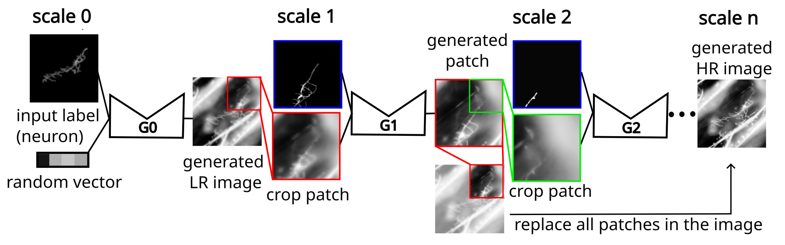
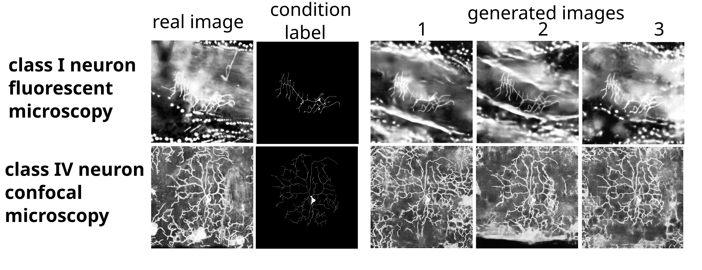

# Multi-scale Stochastic Generation of Labelled Microscopy Images using a cGAN Cascade

This is the code of the model proposed in the "Multi-scale Stochastic Generation of Labelled Microscopy
Images for Neuron Segmentation" paper accepted for the MIDL 2024 conference. <https://openreview.net/forum?id=orE18Wdgbj>

## Overview 

The objective of this model is to automatically generate realistic microscopy images, conditioned on a given neuron morphology input. A multi-scale cascade of conditional generative adversarial networks iteratively refines the generated image resolution using patches of decreasing field-of-view. The diversity of the generated images is enhanced through the loss function and random vectors.

The labelled synthetic image generated can be used to train tracing models. The method can be extended to other tree-like structures such as vessels (e.g. generation of synthetic retina images). 

## How to use

1) Prepare your dataset by organizing images in two separate folders, one for the target images (e.g. microscopy images) and one for the labels (e.g. neuron segmentation). More than one type of labels can be used (e.g. veins / arteries).

2) Follow the steps described in the main file. 

## References

If you use this code, please cite the following article:

